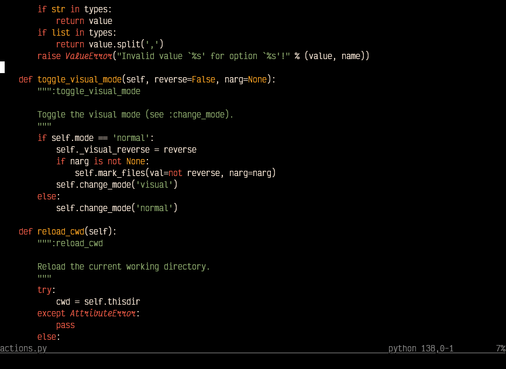

# AutumnRain

This is a fork of [Autumn.nvim](https://github.com/yorickpeterse/Autumn.vim)
with a few changes:

- Transparent background (designed for black terminals)
- Add italics
- Warmer default color (greenish -> reddish)
- Tweaked various colors

AutumnRain is a color scheme inspired by the colors you can find in the autumn.
Originally written as a color scheme for Komodo IDE but ported to Vim by
Kenneth Love and Chris Jones, improved by Yorick Peterse and Yuni.

I (Yuni) found this color scheme when I tried out the Helix editor, which ships
with a ton of built-in color schemes, though "autumn_night" was the only one I
liked, with beautiful natural colors. Turns out it was a port of bespoke
Autumn.vim. I didn't manage to stick with the Helix editor, but wasn't ready to
let go of the color scheme, so I think it's time to revive and polish it :)

## Requirements

* Vim 7 or newer (7.3 or newer is recommended)
* A version of Vim capable of displaying lots of colors. AutumnRain was
  designed to be used in combination with Gvim, Macvim or similar
  implementations of Vim. However, AutumnRain does offer support for 256 color
  terminals but the colors will look slightly different.

## Installation

Place this file into ~/.vim/colors/ and run `:color autumnrain` in vim.

## License

AutumnRain.vim is licensed under the Creative Commons ShareAlike 3 license. Feel
free to modify and share it with others as long as you're nice enough to give
attribution.
